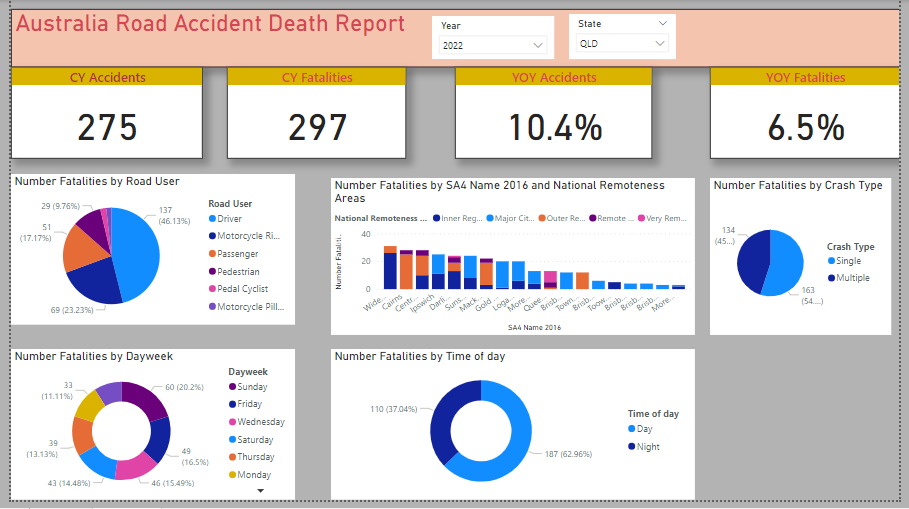

## Australia Road Accidents Analysis

### Objective
This is a data analytics project about the crashes and fatalities on Australian Road.
The dashboard gives the accurate insights of the different aspects of accidents as well as does some time series analysis which can further help us to make data driven decisions.

### Datasets

The data is collected from Australian Road Death Database.
The data set includes the accidents and death details from the period of 1989 to 2023. It includes all the states data with time of occurence, day of the week, age group, gender and etc.

### Data Cleaning

The dataset required some cleaning and standardization. There were some null values and duplicate value which were taken care of using power query editor. A new calendar table was created to perform time series analysis.

### Data Visualization

------------------------------------------

### Findings

- From the dashboard, it can be clearly visualised that the number of accidents percentage have increased by 6.5% in 2022 than previous year.
similarly the number of fatalities have also increased by 5.4% than previous year. 

- 343 which is the maximum number of accidents occuered when the driving  speed was 100.

- For QLD state in year 2022, the total number of accidents are 275 and total number of fatalities are 297 which has increased by 
10.4% and 6.5% respectively than previous year.

- From the visualization, it can be seen that maximum number of fatalities happened on Sundays during day time. Mostly the drivers are succumbed to death which is 46.13% followed by Motorcycle riders which is 23.23%.

